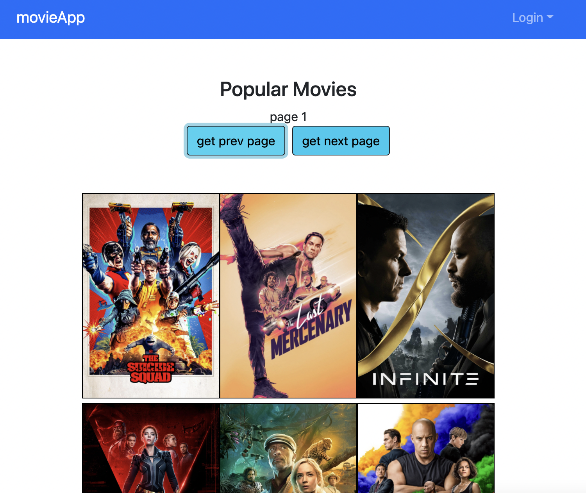
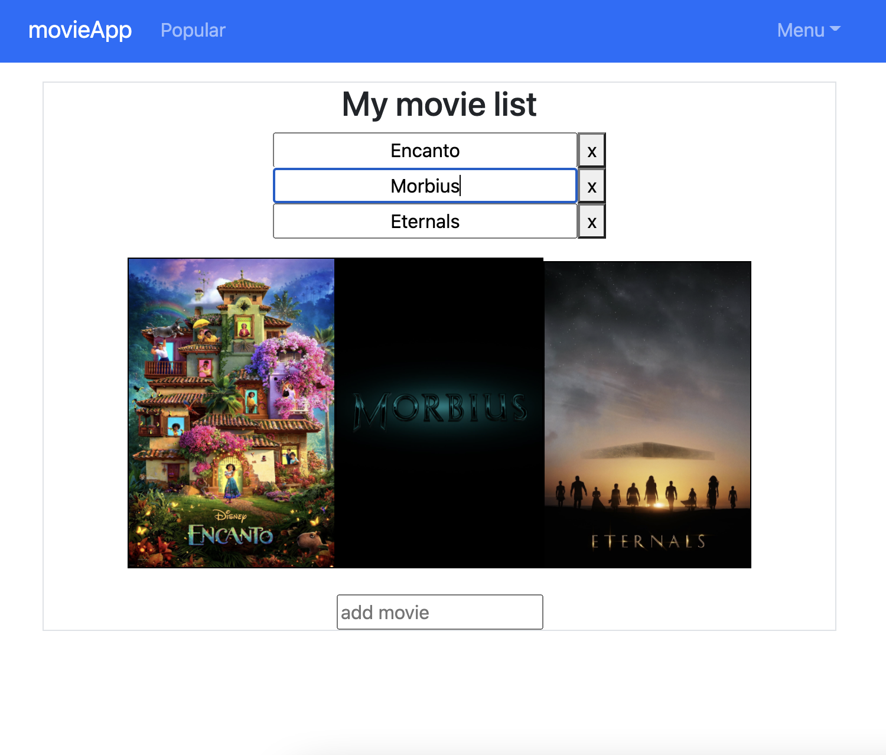

# movie-app-auth-frontend
<a href='https://andrew-movie-app.herokuapp.com'>
 

</a>

[https://andrew-movie-app.herokuapp.com]('./scrn7.png')

## Tech: 

react.js

bootstrap

jest (testing)

## Features:

• Register/Login (using JSON web tokens and bcrypt)

• CRUD (add, read, edit, delete movies)

• Profile page

• Popular movies (API calls to [TMDB](https://developers.themoviedb.org/3))

## [Backend](https://github.com/adnjoo/movie-app-auth-backend)

## Notes

08-14 Added [buildpack](https://github.com/mars/create-react-app-buildpack) to heroku
