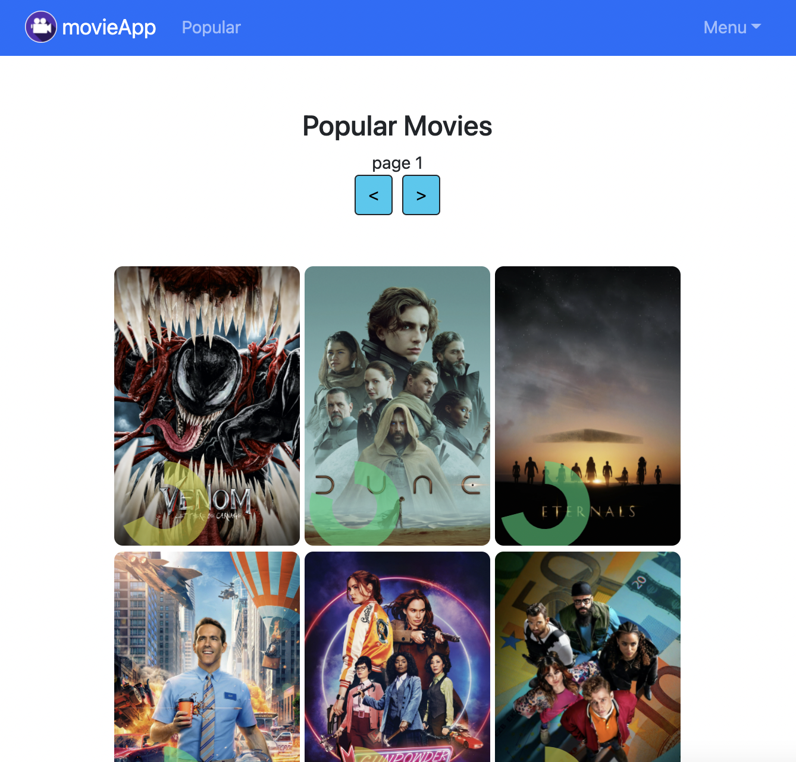

# movie-app-auth-frontend
<a href='https://andrew-movie-app.netlify.app/'>
<br>

</a>

<br>

## Features:

• Register/Login (JWT | bcrypt)

• CRUD (add, read, edit, delete data)

• Profile page (edit username)

• Popular movies (API calls to [TMDB](https://developers.themoviedb.org/3))


## Tech: 

react 18

bootstrap 5

jest (tests)

netlify (deploy)

redux (rtk-query)

[backend](https://github.com/adnjoo/movie-app-auth-backend)

## instructions:

```
git clone https://github.com/adnjoo/movie-app-auth-frontend

cd movie-app-auth-frontend

npm install

npm start
```
